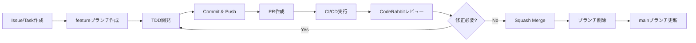

# PRベース開発ワークフローガイド

**作成日**: 2025-12-03  
**対象**: sf-ai-cli-practice-v2

---

## 🎯 基本方針

**個人開発でもPRベースのワークフロー**

- mainブランチへの直接pushは禁止
- すべての変更はPRを経由
- CodeRabbitの自動レビューを活用
- CI/CDチェックを必ず通過

---

## 🔄 開発フロー

### パターン1: シンプルフロー（推奨）

```
main ← feature/* (PR)
```

**用途**: 個人開発、小規模プロジェクト

### パターン2: Git Flow風（将来のチーム開発向け）

```
main ← develop ← feature/* (PR)
```

**用途**: チーム開発移行時

---

## 📝 実践: 初回セットアップ

### Step 1: リモートリポジトリ作成

```bash
# GitHub上でリポジトリ作成（UI操作）
# https://github.com/new
# Repository name: sf-ai-cli-practice-v2
# Description: AI-driven Salesforce CI/CD Platform
# Public or Private: お好みで
# Initialize: チェックなし（ローカルで既に作成済み）
```

### Step 2: ローカルとリモートの接続

```bash
cd /Users/takashin/code/sf-ai-cli-practice-v2

# リモートリポジトリ追加
git remote add origin https://github.com/<your-username>/sf-ai-cli-practice-v2.git

# 確認
git remote -v
```

### Step 3: 初回コミット（developブランチ経由）

```bash
# developブランチ作成
git checkout -b develop

# すべてのファイルをステージング
git add .

# コミット
git commit -m "Initial commit: Phase 0 setup完了

- セキュリティベストプラクティス適用
- 個人情報保護対応完了
- Docker環境構築
- GitHub Actions設定
- ドキュメント整備
- CodeRabbit設定
- MIT License採用"

# developブランチをpush
git push -u origin develop
```

### Step 4: mainブランチ作成とブランチ保護設定

```bash
# mainブランチ作成
git checkout -b main
git push -u origin main

# GitHub UIでブランチ保護設定
# → docs/00-setup/02-github-repository-setup.md を参照
```

### Step 5: 初回PR作成

```bash
# ローカルでdevelopブランチに戻る
git checkout develop

# GitHub UIでPR作成
# develop → main
# Title: "Initial Setup: Phase 0 完了"
# Description: PRテンプレート使用
```

---

## 🚀 日常の開発フロー

### 1. 新機能開発

#### Step 1: issueまたはタスク作成（推奨）

```bash
# GitHub Issues または GitHub Projects でタスク作成
# 例: "Golden Stack導入: Apex Trigger Actions Framework"
```

#### Step 2: featureブランチ作成

```bash
# mainまたはdevelopから派生
git checkout main  # または develop
git pull origin main

# featureブランチ作成
# 命名規則: feature/<タスク番号>-<簡潔な説明>
git checkout -b feature/1-add-trigger-actions-framework

# または
git checkout -b feature/implement-apex-mockery
```

#### Step 3: 開発（TDD）

```bash
# 🔴 Red: テスト作成
# テストファイル作成
touch force-app/main/default/classes/AccountTriggerActionTest.cls

# テスト実装（失敗するテスト）
# ...

# コミット
git add .
git commit -m "test: Add AccountTriggerAction tests (RED)"

# 🟢 Green: 最小実装
# 実装ファイル作成
touch force-app/main/default/classes/AccountTriggerAction.cls

# 実装
# ...

# テスト成功を確認
sf apex run test --test-level RunLocalTests

# コミット
git add .
git commit -m "feat: Implement AccountTriggerAction (GREEN)"

# 🔵 Refactor: リファクタリング
# コード改善
# ...

# コミット
git add .
git commit -m "refactor: Improve AccountTriggerAction readability"
```

#### Step 4: Push & PR作成

```bash
# featureブランチをpush
git push -u origin feature/1-add-trigger-actions-framework

# GitHub UIでPR作成
# または
gh pr create --title "feat: Apex Trigger Actions Framework導入" \
  --body "Closes #1

## 変更内容
- Apex Trigger Actions Frameworkインストール
- AccountTriggerAction実装
- テストカバレッジ95%達成

## テスト
- [x] Apexテストパス
- [x] PMD静的解析クリア
- [x] CodeRabbitレビュー対応
"
```

#### Step 5: CI/CDチェック & CodeRabbitレビュー

```bash
# 自動実行される内容:
# 1. Security Scan (git-secrets, gitleaks)
# 2. File Count Check (80ファイル以下)
# 3. PMD静的解析
# 4. ESLint
# 5. Apexテスト実行
# 6. CodeRabbitレビュー

# CodeRabbitのコメントに対応
# 修正が必要な場合:
git add .
git commit -m "fix: Address CodeRabbit review comments"
git push
```

#### Step 6: Squash Merge

```bash
# GitHub UIで Squash and Merge ボタンをクリック

# または CLI
gh pr merge --squash --delete-branch
```

#### Step 7: ローカル更新

```bash
# mainブランチ更新
git checkout main
git pull origin main

# 不要なブランチ削除
git branch -d feature/1-add-trigger-actions-framework
```

---

## 📏 コミットメッセージ規約

### Conventional Commits

```
<type>(<scope>): <subject>

<body>

<footer>
```

### Type一覧

| Type | 説明 | 例 |
|------|------|-----|
| `feat` | 新機能 | `feat: Add Nebula Logger integration` |
| `fix` | バグ修正 | `fix: Resolve JWT authentication error` |
| `docs` | ドキュメント | `docs: Update setup guide` |
| `style` | コードスタイル | `style: Format with Prettier` |
| `refactor` | リファクタリング | `refactor: Extract common logic to helper` |
| `test` | テスト | `test: Add unit tests for AccountService` |
| `chore` | 雑務 | `chore: Update dependencies` |
| `ci` | CI/CD | `ci: Add CodeQL scanning` |

### 例

```bash
# Good
git commit -m "feat(auth): Implement JWT authentication flow"
git commit -m "test(trigger): Add AccountTriggerAction tests"
git commit -m "fix(security): Remove hardcoded API key"

# Bad
git commit -m "update"
git commit -m "fix bug"
git commit -m "WIP"
```

---

## 🏷️ PRラベル活用

### 推奨ラベル

| ラベル | 用途 |
|--------|------|
| `enhancement` | 新機能 |
| `bug` | バグ修正 |
| `documentation` | ドキュメント |
| `security` | セキュリティ関連 |
| `dependencies` | 依存関係更新 |
| `breaking-change` | 破壊的変更 |
| `WIP` | 作業中（レビュー不要） |

---

## ⚡ ショートカット & Tips

### GitHub CLI (gh) 活用

```bash
# インストール
brew install gh

# 認証
gh auth login

# PR作成
gh pr create

# PR一覧
gh pr list

# PR checkout
gh pr checkout 123

# PR merge
gh pr merge --squash

# Issue作成
gh issue create
```

### Git エイリアス

```bash
# ~/.gitconfig または ~/.zshrc
git config --global alias.co checkout
git config --global alias.br branch
git config --global alias.ci commit
git config --global alias.st status
git config --global alias.unstage 'reset HEAD --'
git config --global alias.last 'log -1 HEAD'
git config --global alias.visual 'log --oneline --graph --decorate'
```

### Jujutsu併用

```bash
# Jujutsuでブランチ作成
jj git fetch
jj new main -m "feature: New feature"
jj describe -m "feat: Implement new feature"

# Git経由でpush
jj git push
```

---

## ❌ やってはいけないこと

### 1. mainへの直接push

```bash
# ❌ ダメ！
git checkout main
git commit -m "fix"
git push origin main

# ✅ 正しい
git checkout -b fix/issue-123
git commit -m "fix: Resolve issue #123"
git push origin fix/issue-123
# → PR作成
```

### 2. 大きすぎるPR

```bash
# ❌ 1つのPRで100ファイル変更
# → CodeRabbitレビュー品質低下

# ✅ 小さいPR（80ファイル以下）
# → 複数のPRに分割
```

### 3. テストなしのコミット

```bash
# ❌ テストなし
git commit -m "feat: New feature"

# ✅ TDD実践
# 1. テスト作成（RED）
# 2. 実装（GREEN）
# 3. リファクタリング（REFACTOR）
```

---

## 📊 ワークフロー可視化

### Mermaid図



---

## 🎯 ベストプラクティス

1. **小さいPR**: 1機能 = 1PR
2. **頻繁にCommit**: 論理的な単位で
3. **TDD実践**: Red → Green → Refactor
4. **CodeRabbit活用**: 指摘は真摯に対応
5. **ドキュメント更新**: コードと同時に

---

**次のステップ**: 実際に開発を開始しましょう！  
**参考**: [TDDガイド](../01-development/tdd-guide.md)
