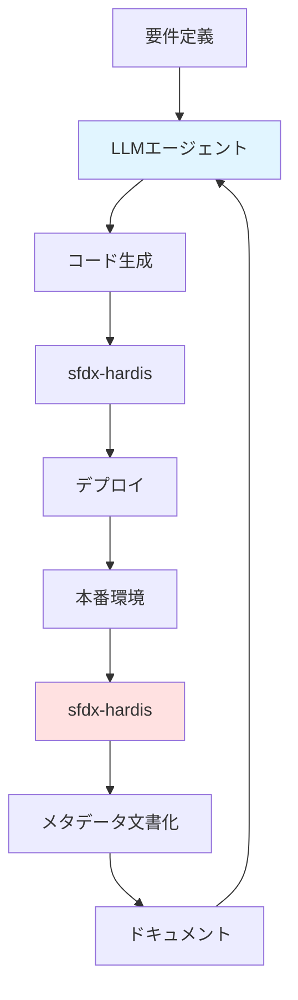

# Architecture Decision Records (ADR)

**プロジェクト**: sf-ai-cli-practice-v2  
**作成日**: 2025-12-03  
**最終更新**: 2025-12-15

---

## 📋 目次

1. [Decision 1: Service層アーキテクチャ](#decision-1-service層アーキテクチャ)
2. [Decision 2: AI Provider](#decision-2-ai-provider)
3. [Decision 3: Query Builder](#decision-3-query-builder)
4. [Decision 4: 命名規則](#decision-4-命名規則)
5. [Decision 5: ツール戦略（sfdx-hardis vs マルチLLMエージェント）](#decision-5-ツール戦略)


---

## Decision 1: Service層アーキテクチャ

### ステータス: 🟡 暫定決定（Phase 2で再評価）

### コンテキスト

Salesforce開発におけるビジネスロジック層の設計方針を決定する必要がある。

### 選択肢

#### A. fflib-apex-common（エンタープライズパターン）
```yaml
利点:
  - Service/Domain/Selector層の明確な分離
  - UnitOfWorkパターンでトランザクション管理
  - 依存性注入（Force-DI）
  - 大規模プロジェクトで実績

欠点:
  - 学習曲線が急
  - 小規模プロジェクトには過剰
  - ボイラープレートコード増加
```

#### B. Simple Architecture with Trigger Actions Framework
```yaml
利点:
  - シンプルで理解しやすい
  - メタデータ駆動（コードデプロイ不要）
  - Flow統合可能
  - 小〜中規模プロジェクトに最適

欠点:
  - 大規模化時のリファクタリング必要
  - トランザクション管理は手動
```

### 決定: **B. Simple Architecture（Phase 0-1）**

#### 理由

1. **個人開発フェーズ**: 現時点では複雑性が不要
2. **学習コスト**: 即座に生産性を発揮可能
3. **柔軟性**: Phase 2以降でfflibへ移行可能
4. **Trigger Actions Framework**: メタデータ駆動で変更容易

#### Phase 0-1 実装方針

```yaml
アーキテクチャ:
  Trigger Layer:
    - Apex Trigger Actions Framework使用
    - メタデータでハンドラー制御
  
  Business Logic Layer:
    - シンプルなServiceクラス（必要時のみ）
    - Utility/Helperクラス
  
  Data Access Layer:
    - Query Builder（Decision 3で選定）
    - Dynamic SOQL with FLS/CRUD checks
```

#### Phase 2 再評価ポイント

```yaml
fflibへ移行検討する条件:
  - ビジネスロジックが複雑化（クラス数50+）
  - 複数開発者の協業開始
  - トランザクション整合性が重要になる
  - テスタビリティ向上の必要性
```

---

## Decision 2: AI Provider

### ステータス: 🟢 決定（Phase 0）

### コンテキスト

sfdx-hardisのAI機能（Flow/Apexドキュメント自動生成、デプロイアシスタント）で使用するAI Providerを選定。

### 選択肢

#### A. Anthropic Claude
```yaml
利点:
  - sfdx-hardis公式推奨
  - claude-3-5-sonnet: 高性能
  - コンテキスト長大（200K tokens）
  - コストパフォーマンス良好

欠点:
  - 日本語対応は英語より劣る（改善中）
```

#### B. OpenAI GPT-4
```yaml
利点:
  - 高品質な日本語対応
  - 広範な知識ベース
  - 豊富なエコシステム

欠点:
  - Claude比でコスト高
  - コンテキスト長制限（128K tokens）
```

#### C. Agentforce（Salesforce AI）
```yaml
利点:
  - Salesforce統合
  - データセキュリティ（Salesforce内）
  - Trust Layer

欠点:
  - Salesforce Foundations必要（コスト）
  - 個人開発には過剰
```

### 決定: **A. Anthropic Claude（Phase 0-2）**

#### 理由

1. **sfdx-hardis推奨**: 公式で最適化済み
2. **コストパフォーマンス**: 個人開発予算に適合
3. **高性能**: claude-3-5-sonnetは最新世代
4. **将来性**: Phase 3以降でAgentforce検討可可能

#### 設定

```yaml
# .env.local
ANTHROPIC_API_KEY=sk-ant-...
ANTHROPIC_MODEL=claude-3-5-sonnet
PROMPTS_LANGUAGE=ja
AI_MAXIMUM_CALL_NUMBER=5000

月間コスト見積:
  ドキュメント生成: ~$5-10/月
  デプロイアシスタント: ~$3-5/月
  合計: ~$10-15/月
```

#### Phase 3 再評価ポイント

```yaml
Agentforceへ移行検討する条件:
  - チーム3人以上に拡大
  - Salesforce Foundations導入
  - コンプライアンス要件強化
  - 月間AI利用コスト$100超過
```

---

## Decision 3: Query Builder

### ステータス: 🔶 評価中（Phase 1-2で決定）

### コンテキスト

動的SOQLクエリの構築方法を統一し、保守性・セキュリティ・テスタビリティを向上させる。

### 選択肢

#### A. SOQL Lib
```yaml
GitHub: beyond-the-cloud-dev/soql-lib
特徴:
  - Fluent Interface（メソッドチェーン）
  - 型安全
  - モック対応良好
  - 軽量（依存関係最小）

利点:
  - 学習コスト低
  - パフォーマンス良好
  - テストしやすい

欠点:
  - コミュニティ小規模
  - 機能が基本的
```

#### B. Nebula Query & Search
```yaml
GitHub: jongpie/NebulaQueryAndSearch
特徴:
  - Nebulaエコシステム統合
  - FLS自動チェック
  - 豊富な機能
  - 複雑クエリ対応

利点:
  - セキュア（FLS自動）
  - Nebula Loggerと統合
  - 高機能

欠点:
  - Nebulaエコシステム依存
  - 学習コスト高
  - オーバーヘッド
```

#### C. ApexEloquent (NEW)
```yaml
GitHub: krile136/ApexEloquent
特徴:
  - Laravel EloquentのApex移植版
  - Fluent Interface（Scribeクラス）
  - MockEloquentによるDB非依存テスト
  - リレーションシップ処理の革新（parent/children/through）
  - Select-Forgotten Detection

利点:
  - テスト速度の劇的向上（数秒 → 数ミリ秒）
  - モックデータによる単体テストの安定化
  - 親子・多対多関係の記述が簡潔
  - LaravelからのWeb開発者にとって学習容易
  - ランタイムエラーの開発段階での検出

欠点:
  - 個人開発プロジェクト（krile136氏）
  - コミュニティ規模不明
  - ドキュメントがREADMEのみ
  - FLS/CRUD自動チェック機能なし
```

> [!IMPORTANT]
> ApexEloquentは「テスト駆動開発（TDD）」を最優先する場合の最有力候補。MockEloquentによりDB操作なしでロジックを高速検証できる点が最大の差別化要因。

### 比較マトリクス

| 観点 | SOQL Lib | Nebula Query | ApexEloquent |
|------|----------|--------------|-------------|
| **学習コスト** | 低 ✅ | 中〜高 | 中（Laravel経験者は低） |
| **モッキング** | 良好 | 標準的 | 優秀 ✅ |
| **リレーション記述** | 標準的 | 良好 | 優秀 ✅ |
| **セキュリティ** | 手動FLS | 自動FLS ✅ | 手動FLS |
| **エコシステム統合** | なし | Nebula Logger | なし |
| **テスト速度** | 標準的 | 標準的 | 超高速 ✅ |
| **コミュニティ** | 小規模 | 中規模 ✅ | 不明 |
| **メンテナンス** | アクティブ | アクティブ ✅ | 不明 |

### Phase 1-2 評価計画

```yaml
評価方法:
  1. 3つ全てインストール（Phase 1）
  2. 同一クエリセットを実装
     ユースケース:
       - Account検索（動的条件複数）
       - 親子関係取得（Account → Contacts）
       - 多対多関係（Order → OrderItem → Product2）
       - 集計クエリ（GROUP BY + HAVING）
  
  3. 比較評価基準
     コード品質:
       - 可読性（コードレビュー容易性）
       - 保守性（変更時の影響範囲）
     
     テスト容易性:
       - モック作成の難易度
       - テスト実行速度
       - テストの安定性（Flaky Testの少なさ）
     
     運用面:
       - パフォーマンス（実行時オーバーヘッド）
       - セキュリティ（FLS/CRUD）
       - 学習コスト（新規メンバー参画時）

決定基準（Phase 2）:
  シンプル重視: SOQL Lib
  セキュリティ/統合重視: Nebula Query
  TDD/テスト速度重視: ApexEloquent
  
  複合戦略も検討:
    - 単体テスト層: ApexEloquent（モッキング）
    - 結合テスト層: SOQL Lib or Nebula Query（実DB）
```

> [!NOTE]
> ApexEloquentの詳細分析は [sfdx-hardisとApexライブラリ比較.md](file:///Users/takashin/code/sf-ai-cli-practice-v2/docs/sfdx-hardisとApexライブラリ比較.md) を参照。

---

## Decision 4: 命名規則

### ステータス: 🟢 決定（Phase 1）

### コンテキスト

プロジェクト全体で統一された命名規則が必要。Salesforceオブジェクト、項目、Apex、LWC、Flowなどすべてのコンポーネントに適用。

### 選択肢

#### A. Snake_Case
```yaml
例:
  - Opportunity_Competitor__c
  - Total_Amount__c
  - Get_Lead (Flow)

利点:
  - Salesforceデフォルトに近い
  - 単語の区切りが明確

欠点:
  - モダンな開発慣習と異なる
  - タイプ量が増える
```

#### B. PascalCase (Upper Camel Case)
```yaml
例:
  - OpportunityCompetitor__c
  - TotalAmount__c
  - GetLead (Flow)

利点:
  - モダンな開発慣習に準拠
  - 可読性が高い
  - Apex/JavaScriptとの親和性
  - 多くのSalesforceベストプラクティスで推奨

欠点:
  - Salesforceデフォルト設定と若干異なる
```

### 決定: **B. PascalCase（Phase 1-）**

#### 理由

1. **モダンな慣習**: 現代的な開発スタンダードに準拠
2. **言語間の一貫性**: Apex(PascalCase)、JavaScript(camelCase)との親和性
3. **可読性**: 単語の区切りが視覚的に明確
4. **コミュニティベストプラクティス**: 多くのSalesforce専門家が推奨

#### 詳細ドキュメント

完全な命名規則は [development-standards.md](file:///Users/takashin/code/sf-ai-cli-practice-v2/docs/development-standards.md) を参照

```yaml
主要ルール:
  カスタムオブジェクト: OpportunityCompetitor__c
  カスタム項目: TotalAmount__c
  Boolean項目: IsActive__c
  数式項目: TotalRevenue_f__c
  Apexクラス: AccountService, ContactTriggerHandler
  Apex変数: camelCase (accountName, totalCount)
  Apex定数: UPPER_SNAKE_CASE (MAX_RECORDS)
  LWCコンポーネント: camelCase (accountList)
  Flow要素: Get_Account, Create_Opportunity
```

---

## Decision 5: ツール戦略

### ステータス: 🟢 決定（Phase 1）

### コンテキスト

sfdx-hardis（Phase 1-2）とマルチLLMエージェント環境（Phase 3+）の役割が重複する可能性があるため、明確な分担が必要。

### 選択肢

#### A. sfdx-hardisのみ使用
```yaml
利点:
  - ツールの一元化
  - 学習コスト低減
  - 実績のあるツール

欠点:
  - AI駆動のコード生成ができない
  - カスタマイズ性が限定的
  - Phase 3以降のビジョン実現不可
```

#### B. マルチLLMエージェントのみ使用
```yaml
利点:
  - 最新のAI技術活用
  - 柔軟なカスタマイズ
  - 長期的なビジョンに合致

欠点:
  - Phase 1-2で実装コストが高い
  - 安定性が不確実
  - デプロイ基盤が未整備
```

#### C. 役割分担して両方使用
```yaml
利点:
  - 各ツールの強みを活用
  - 段階的な移行が可能
  - 短期・長期両方に対応

欠点:
  - 複数ツール管理の複雑性
  - 統合の手間
```

### 決定: **C. 役割分担して両方使用（Phase 1-）**

#### 理由

1. **Short-term vs Long-term**: Phase 1-2は実績あるsfdx-hardis、Phase 3+でAI統合
2. **補完関係**: 重複ではなく、互いを補完する関係
3. **段階的移行**: リスクを抑えた漸進的アプローチ

#### 役割分担

```yaml
sfdx-hardis（Phase 1-2）:
  役割: "管理する・記録する"
  用途:
    - CI/CDオーケストレーション
    - 既存メタデータの文書化
    - 未使用メタデータ検出
    - デプロイ管理
    - 静的スナップショット生成
  
  特徴:
    - 受動的（既存の状態を記録）
    - 定期実行タスク
    - システム管理者向け

マルチLLMエージェント（Phase 3+）:
  役割: "作る・最適化する"
  用途:
    - 新規コード生成（Apex, LWC）
    - テストコード自動生成
    - リファクタリング実行
    - ビジネスロジック実装
    - AIドリブンなレビュー
  
  特徴:
    - 能動的（新しいものを創造）
    - 要件駆動
    - 開発者向け
```

#### 統合戦略



**フィードバックループ:**
1. LLMエージェントがコード生成
2. sfdx-hardisがデプロイ・文書化
3. 生成されたドキュメントをLLMエージェントが読み取り
4. コンテキストとして次の開発に活用

---

## Decision 6: テストデータ管理戦略

### ステータス: 🔶 評価中（Phase 1-2で決定）

### コンテキスト

Salesforce開発におけるテストデータ管理は、以下の2つの異なる課題を抱えている:
1. **単体テスト**: ロジックの正しさを高速に検証するためのモックデータ
2. **結合テスト**: 実環境に近いデータセットでの動作確認

これらを適切に使い分ける戦略が必要。

### テストピラミッドの概念

```yaml
テストピラミッド:
  E2Eテスト（頂点）:
    - 量: 少ない（5-10%）
    - 速度: 遅い（分単位）
    - 安定性: 低い（環境依存）
  
  結合テスト（中層）:
    - 量: 中程度（20-30%）
    - 速度: 中程度（秒単位）
    - 安定性: 中程度
    - データ: SFDMU（実DB）
  
  単体テスト（基盤）:
    - 量: 多い（60-70%）
    - 速度: 高速（ミリ秒単位）
    - 安定性: 高い（環境非依存）
    - データ: MockEloquent（メモリ）
```

### 選択肢

#### A. ApexBlueprint（モックデータFactory）

```yaml
GitHub: krile136/ApexBlueprint
用途: 単体テスト用のモックデータ生成

利点:
  - テストコードの記述量削減
  - ApexEloquent MockEloquentとの統合

欠点:
  - 開発初期段階（成熟度不明）
  - メンテナンス継続性が不透明

リスク: HIGH
```

#### B. 手動Factoryパターン

```yaml
用途: 単体テスト用のモックデータ生成

利点:
  - 外部依存なし
  - 完全なコントロール

欠点:
  - 初期実装コスト

リスク: LOW
```

#### C. sfdx-hardis SFDMU

```yaml
用途: 結合テスト用のデータシーディング

利点:
  - 親子関係維持
  - 本番類似データ

欠点:
  - 単体テストには不向き

リスク: LOW
```

### 決定: **レイヤー別複合戦略（Phase 1-）**

#### 理由

1. **テストピラミッドの実現**: 各レイヤーに最適なツールを使い分ける
2. **速度と信頼性のバランス**: 高速な単体テスト + 信頼性の高い結合テスト
3. **段階的導入**: Phase 1は手動Factory、Phase 2以降でApexBlueprint検討

#### Phase別方針

```yaml
Phase 1:
  単体テスト層:
    ツール: 手動Factory
    実装: TestDataFactory.cls作成
  
  結合テスト層:
    ツール: sfdx-hardis SFDMU
    実装: export.json設定

Phase 2:
  ApexBlueprint導入検討
  条件:
    - プロジェクト成熟度の確認
    - ApexEloquent採用が確定
```

#### 使い分け

| テスト種別 | ツール | データ | 速度 | 用途 |
|-----------|--------|-------|------|------|
| **単体** | MockEloquent + Factory | メモリ | ミリ秒 | ロジック検証 |
| **結合** | 標準Apex + SFDMU | DB | 秒 | 連携検証 |
| **E2E** | sfdx-hardis | DB | 分 | 最終確認 |

> [!CAUTION]
> ApexBlueprintは開発初期段階のため、Phase 1では依存を避け、手動Factoryで実装。Phase 2で再評価。

---

## 決定のトレーサビリティ

| Decision | Phase 0 | Phase 1 | Phase 2 | Phase 3+ |
|----------|---------|---------|---------|----------|
| Service層 | Simple ✅ | Simple継続 | 再評価 | fflib検討 |
| AI Provider | Claude ✅ | Claude継続 | 再評価 | Agentforce検討 |
| Query Builder | - | 3種評価 🔄 | 決定 🎯 | - |
| 命名規則 | - | PascalCase ✅ | 継続 | 継続 |
| ツール戦略 | - | 両方使用 ✅ | 両方使用 | 統合強化 |
| Test Data | - | 手動Factory ✅ | ApexBlueprint検討 | - |


---

## 参考資料

### Development Standards
- [Development Standards & Naming Conventions](file:///Users/takashin/code/sf-ai-cli-practice-v2/docs/development-standards.md)

### Service層
- [fflib-apex-common](https://github.com/apex-enterprise-patterns/fflib-apex-common)
- [Apex Trigger Actions Framework](https://github.com/mitchspano/apex-trigger-actions-framework)

### AI Providers
- [Anthropic Claude](https://www.anthropic.com/claude)
- [sfdx-hardis AI Guide](https://sfdx-hardis.cloudity.com/hardis/doc/ai/)

### Query Builders
- [SOQL Lib](https://github.com/beyond-the-cloud-dev/soql-lib)
- [Nebula Query & Search](https://github.com/jongpie/NebulaQueryAndSearch)
- [ApexEloquent](https://github.com/krile136/ApexEloquent)

### Test Data Management
- [ApexBlueprint](https://github.com/krile136/ApexBlueprint)
- [sfdx-hardis Data Commands](https://sfdx-hardis.cloudity.com/hardis/org/data/export/)

### Analysis Documents
- [sfdx-hardisとApexライブラリ比較](file:///Users/takashin/code/sf-ai-cli-practice-v2/docs/sfdx-hardisとApexライブラリ比較.md)

### Tools
- [sfdx-hardis Documentation](https://sfdx-hardis.cloudity.com/)


---

**次回更新**: Phase 2開始時（2025 Q2予定）
