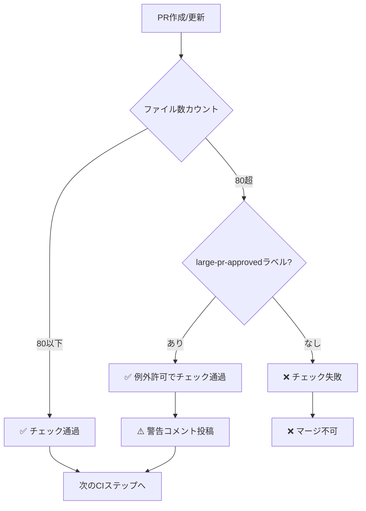

# PRファイル数制限ガイド

**最終更新**: 2025-12-12

---

## 📋 概要

このプロジェクトでは、CodeRabbitの最適なレビュー品質を維持するため、**PRファイル数を80以下**に制限しています。

## 🎯 制限ルール

### 通常のPR
- **制限**: 80ファイル以下
- **超過時**: CI失敗（マージ不可）
- **推奨**: 小さく分割して段階的にマージ

### 例外が必要な場合
- **方法**: `large-pr-approved` ラベルを追加
- **効果**: 80ファイル超でもCI通過
- **注意**: CodeRabbitのレビュー品質が低下する可能性あり

---

## 🏷️ ラベルの使用方法

### `large-pr-approved` ラベルを追加

1. PR画面の右サイドバーで **Labels** をクリック
2. `large-pr-approved` を選択
3. CIが自動的に再実行され、チェックが通過

### 使用が推奨されるケース

- ✅ 初期セットアップ（Phase 0完了時など）
- ✅ 大規模リファクタリング（事前承認済み）
- ✅ フレームワーク導入（Golden Stackなど）
- ✅ 自動生成コード（大量のメタデータ）

### 避けるべきケース

- ❌ 複数の機能を一つのPRに詰め込む
- ❌ レビュー負担を避けるための安易な使用
- ❌ 定期的な開発作業

---

## ✂️ PRを分割する方法

### 推奨分割パターン

#### 1. レイヤー別
```
PR #1: データモデル（オブジェクト・フィールド）
PR #2: ビジネスロジック（Apexクラス）
PR #3: UI（LWC）
PR #4: 設定・ワークフロー
```

#### 2. 機能別
```
PR #1: ユーザー管理機能
PR #2: 商品管理機能
PR #3: 注文処理機能
```

#### 3. 段階別
```
PR #1: 基盤コード（インターフェース・抽象クラス）
PR #2: 実装コード（具象クラス）
PR #3: テストコード
PR #4: ドキュメント
```

---

## 🤖 自動チェックの動作

### CI実行フロー



### PRコメント例

#### 制限内の場合
```
## 📊 PR File Count Check

**Files changed:** 45
**CodeRabbit recommended limit:** 80

✅ **Status:** Within recommended limit

This PR is optimally sized for CodeRabbit review.
```

#### 超過（承認なし）の場合
```
## 📊 PR File Count Check

**Files changed:** 120
**CodeRabbit recommended limit:** 80

❌ **Status:** Exceeds recommended limit

**Actions required:**
1. ✂️ Split into smaller PRs (recommended)
2. 🏷️ Add `large-pr-approved` label if justified

**Why split?** CodeRabbit provides better review quality for PRs under 80 files.
```

#### 超過（承認あり）の場合
```
## 📊 PR File Count Check

**Files changed:** 120
**CodeRabbit recommended limit:** 80

⚠️ **Status:** Exceeds limit but approved

This PR has the `large-pr-approved` label and will proceed to review.

**Note:** Large PRs may receive less detailed CodeRabbit feedback.
```

---

## 📊 統計とモニタリング

### 推奨KPI

- **平均PRファイル数**: 30-50ファイル（理想）
- **80ファイル超のPR**: 全体の10%以下
- **large-pr-approved使用率**: 月1-2回程度

### 確認方法

```bash
# 最近のPRのファイル数を確認
gh pr list --state all --limit 10 --json number,files

# large-pr-approvedラベルの使用状況
gh pr list --state all --label "large-pr-approved"
```

---

## 🔧 トラブルシューティング

### Q: ラベルを追加したのにCIが失敗する

**A**: CIを手動で再実行してください

```bash
# GitHub UIから
Actions タブ → 該当ワークフロー → Re-run jobs

# GitHub CLIから
gh run rerun <run-id>
```

### Q: どうしても80ファイル超を避けられない

**A**: 以下を確認してください

1. 本当に一つのPRにまとめる必要があるか？
2. 自動生成ファイルを除外できないか？
3. ドキュメント更新を別PRにできないか？
4. 正当な理由があれば `large-pr-approved` を使用

---

## 📚 関連ドキュメント

- [CodeRabbitセットアップガイド](../../docs/01-development/coderabbit-setup-guide.md)
- [PRワークフローガイド](../../docs/01-development/pr-workflow-guide.md)
- [.coderabbit.yaml](../../.coderabbit.yaml)

---

**次のアクション**: [PRワークフローガイド](../../docs/01-development/pr-workflow-guide.md)を確認
