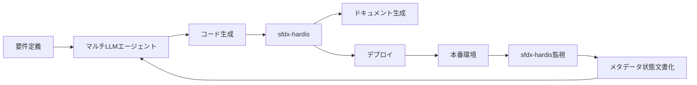

# Development Standards & Naming Conventions

**プロジェクト:** sf-ai-cli-practice-v2  
**作成日:** 2025-12-12  
**最終更新:** 2025-12-12

---

## 📋 目次

1. [命名規則](#命名規則)
2. [コーディング規約](#コーディング規約)
3. [ドキュメンテーション基準](#ドキュメンテーション基準)
4. [ツール活用方針](#ツール活用方針)

---

## 命名規則

### API命名の基本原則

#### 1. 統一性
- **最重要:** プロジェクト全体で一貫した命名規則を維持
- チーム全員が同じ規則に従う
- 本番環境ではAPI名を変更しない（破壊的変更を避ける）

#### 2. 可読性
- 目的が明確に分かる名前を使用
- 過度な省略形を避ける
- API名（システム用）とラベル（ユーザー用）を区別

---

### ケーシング規則

**このプロジェクトでは PascalCase を採用**

```yaml
選定理由:
  - Salesforce標準に近い
  - 可読性が高い
  - モダンな開発慣習に準拠

例:
  正: OpportunityCompetitor__c
  誤: opportunity_competitor__c
  誤: opportunitycompetitor__c
```

---

### カスタムオブジェクト

#### 命名パターン
```
<BusinessConcept>[__c]

例:
  - ProjectMilestone__c
  - CustomerFeedback__c
  - SalesTarget__c
```

#### ルール
- **PascalCase** を使用
- ビジネスコンセプトを明確に表現
- 複数形は避ける（単数形を使用）
- 略語は一般的に認知されているもののみ（例: `API`, `URL`, `ID`）

---

### カスタム項目

#### 基本パターン
```
<DescriptiveName>[__c]

例:
  - TotalAmount__c
  - CustomerEmail__c
  - IsActive__c
```

#### Boolean項目
```
<Is|Has|Are><Condition>[__c]

例:
  - IsActive__c
  - HasOpportunities__c
  - AreTasksCompleted__c
```

#### 数式項目
```
<DescriptiveName>_f[__c]

例:
  - TotalRevenue_f__c
  - DaysUntilExpiration_f__c
  - FullName_f__c
```

#### パーセント項目
```
<Metric>Percent[__c]

例:
  - DiscountPercent__c
  - CompletionPercent__c
  - GrowthPercent__c (❌ 誤: Growth__c)
```

#### 日付・日時項目
```
<Event><Date|DateTime>[__c]

例:
  - StartDate__c
  - CompletionDateTime__c
  - LastReviewDate__c
```

#### 関連項目（Lookup/Master-Detail）
```
<RelatedObject>[__c]

例:
  - Account__c
  - PrimaryContact__c
  - ParentProject__c
```

---

### Apexクラス

#### クラス命名パターン
```
<Purpose><Type>

例:
  - AccountService
  - OpportunityTriggerHandler
  - EmailUtility
  - ContactSelector
  - OrderBuilder (for test data)
```

#### タイプ別サフィックス

```yaml
Service層:
  - AccountService
  - OpportunityService
  
Trigger Handler:
  - ContactTriggerHandler
  - LeadTriggerHandler
  
Utility/Helper:
  - DateUtility
  - StringHelper
  - ValidationUtility
  
Selector (SOQL):
  - AccountSelector
  - OpportunitySelector
  
Test Classes:
  - AccountServiceTest
  - ContactTriggerHandlerTest
  
Test Data Builders (ApexBluePrint):
  - AccountBuilder
  - ContactBuilder
  - OpportunityBuilder
  
Batch/Queueable:
  - DataCleanupBatch
  - EmailNotificationQueueable
  
Scheduled:
  - DailyReportSchedulable
```

---

### Apex変数・メソッド

#### 変数命名
```java
// camelCase を使用
String accountName;
Integer totalCount;
Boolean isActive;
List<Account> accountList;
Map<Id, Contact> contactMap;

// 定数は UPPER_SNAKE_CASE
public static final Integer MAX_RECORDS = 200;
public static final String DEFAULT_STATUS = 'Active';
```

#### メソッド命名
```java
// 動詞で始める (camelCase)
public void calculateTotal() { }
public Boolean isEligible() { }
public List<Account> getActiveAccounts() { }
public void setCustomerEmail(String email) { }

// Boolean返却メソッド
public Boolean hasPermission() { }
public Boolean isValid() { }
public Boolean canProceed() { }
```

---

### Flowリソース・要素

#### リソース（変数、数式など）
```
<Noun>

例:
  - Account_Record
  - Total_Amount
  - Selected_Contact
  - Error_Message
```

#### 要素（アクション）
```
<Verb>_<Object>

例:
  - Get_Account
  - Create_Opportunity
  - Send_Email
  - Update_Contact
```

#### Decision要素
```
質問形式で命名

例:
  - Is_Active
  - Has_Opportunities
  - Amount_Greater_Than_1000
```

#### Decision Outcome
```
<DecisionName>_<Outcome>

例:
  - Is_Active_True
  - Is_Active_False
  - Amount_Greater_Than_1000_Yes
  - Amount_Greater_Than_1000_No
```

---

### Lightning Web Components

#### コンポーネント命名
```
<feature><ComponentType>

例:
  - accountList
  - opportunityCard
  - customDataTable
  - emailComposer
```

#### ファイル命名
```
lwc/
  accountList/
    accountList.html
    accountList.js
    accountList.css
    accountList.js-meta.xml
```

#### JavaScript変数・関数
```javascript
// camelCase
let accountRecords;
const maxResults = 100;

// プライベートプロパティは _ プレフィックス
_internalState;

// 関数は動詞で始める
handleClick() { }
fetchAccounts() { }
validateForm() { }
```

---

## コーディング規約

### Apex

#### クラス構造
```java
/**
 * @description サービスクラスの説明
 * @author takashin
 * @date 2025-12-12
 */
public with sharing class AccountService {
    
    // 定数
    private static final Integer MAX_RECORDS = 200;
    
    // プライベート変数
    private static AccountSelector selector = new AccountSelector();
    
    // パブリックメソッド
    public static List<Account> getActiveAccounts() {
        // 実装
    }
    
    // プライベートヘルパーメソッド
    private static Boolean isValid(Account acc) {
        // 実装
    }
}
```

#### セキュリティ
```java
// 常にsharing設定を明示
public with sharing class AccountService { }
public without sharing class SystemLevelService { }
public inherited sharing class FlexibleService { }

// CRUD/FLS チェック
if (Schema.sObjectType.Account.isAccessible()) {
    // クエリ実行
}
```

#### SOQL
```java
// 動的SOQLでは必要な項目のみ取得
List<Account> accounts = [
    SELECT Id, Name, Industry
    FROM Account
    WHERE IsActive__c = true
    LIMIT :MAX_RECORDS
];

// バルク対応
for (Account acc : accounts) {
    // 処理
}
```

---

### JavaScript (LWC)

#### ESLint準拠
```javascript
// 厳格モード
'use strict';

// const優先、必要な場合のみlet
const MESSAGE = 'Hello';
let counter = 0;

// アロー関数
const calculateTotal = (items) => {
    return items.reduce((sum, item) => sum + item.value, 0);
};
```

---

## ドキュメンテーション基準

### Apexドキュメント

#### クラスレベル
```java
/**
 * @description Accountオブジェクトのビジネスロジック層
 * @author takashin
 * @date 2025-12-12
 * @group Services
 */
public with sharing class AccountService {
```

#### メソッドレベル
```java
/**
 * @description アクティブなAccountレコードを取得
 * @param industryFilter 業種フィルター（オプション）
 * @return アクティブなAccountのリスト
 * @example
 * List<Account> accounts = AccountService.getActiveAccounts('Technology');
 */
public static List<Account> getActiveAccounts(String industryFilter) {
```

### 項目のヘルプテキスト

```
エンドユーザー向け:
  - 平易な日本語
  - 例を含める
  - 制約事項を明記

開発者向けDescription:
  - データ型、用途、依存関係
  - 計算ロジック（数式の場合）
  - 更新日・作成者
```

---

## ツール活用方針

### sfdx-hardis vs マルチLLMエージェント環境

**役割分担を明確化し、重複を避ける**

#### sfdx-hardis（Phase 1-2）
```yaml
用途:
  - CI/CDオーケストレーション
  - 静的メタデータドキュメント生成
  - 未使用メタデータ検出
  - デプロイ管理

特徴:
  - 既存メタデータの状態を文書化
  - 自動化された定期タスク
  - ドキュメントの「スナップショット」作成
```

#### マルチLLMエージェント環境（Phase 3以降）
```yaml
用途:
  - 新規コード生成（Apex, LWC）
  - テストコード自動生成
  - リファクタリング提案・実行
  - ビジネスロジック実装
  - AIドリブンなコードレビュー

特徴:
  - 能動的なコード作成
  - 要件からの自動実装
  - 継続的な最適化提案
  - 人間との協調作業
```

#### 統合戦略


**「作る」= LLMエージェント、「管理する・記録する」= sfdx-hardis**

---

## 違反時の対応

### Lintエラー
```bash
# 自動修正
npm run lint:fix
npm run prettier

# 手動確認
npm run lint
npm run prettier:check
```

### 命名規則違反
- PRレビューで指摘
- CodeRabbitによる自動検出
- 本番前に必ず修正

---

## 参考資料

- [Salesforce Developer Guide - Naming Conventions](https://developer.salesforce.com/)
- [Apex Style Guide](https://developer.salesforce.com/docs/atlas.en-us.apexcode.meta/apexcode/)
- [LWC Style Guide](https://developer.salesforce.com/docs/component-library/documentation/en/lwc)

---

**次回更新:** Phase 2開始時（命名規則の追加・改訂）
